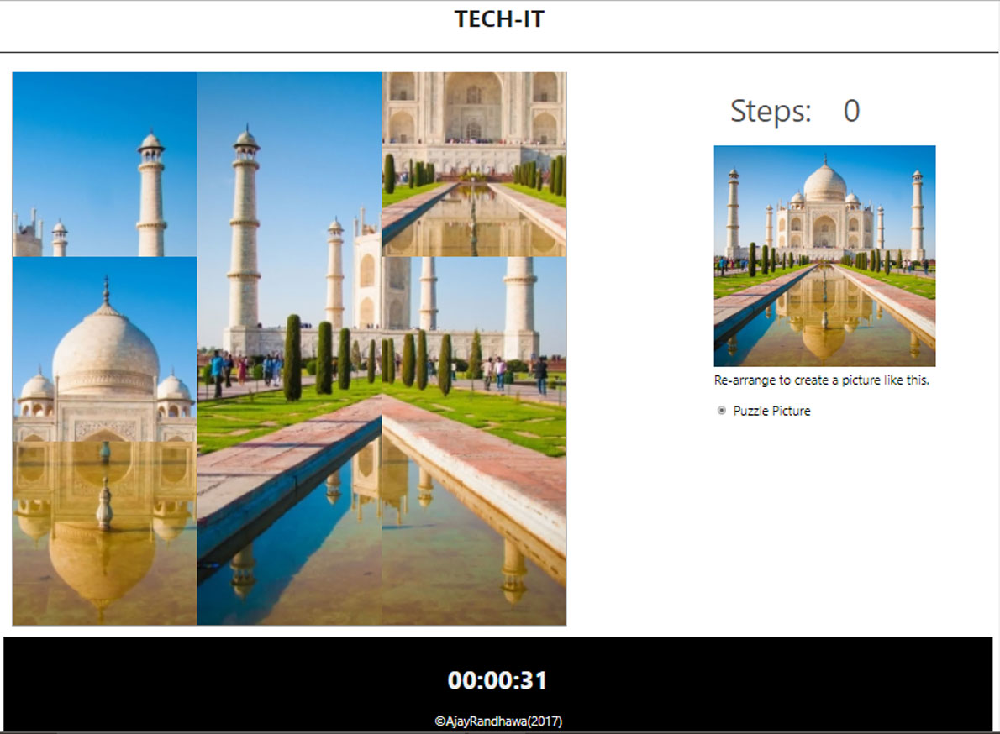

# Image-Puzzle-Game
Image Puzzle is Game For I Designed College Technical Event. It Is Designed With HTML, CSS, Javascript, Jquery. Image Complete with Mouse drag Functionalities . It Has Also Step Count and Time Count Functionalities.You Can Also Switch to Difficulty Mode.

### Prerequisites

1. Webbrowser
2. Text Editor

### Installing

1. Clone this repository: git clone https://github.com/ajayrandhawa/Image-Puzzle-Game.git
2. open index.html file in browser
3. Play the game with mouse drag 'n drop

## Game View



## Increase Difficulty of Game

open "index.html" file in notepad and edit input value.

```
Change Value of Input Field "value=3" eg: "value="9" 
<input type="radio" name="level" id="hard" checked="checked" value="3" /> <label for="hard">Puzzle Picture</label>
```

## Version

2.0

## Authors

Ajay Randhawa

 ## Donate
If you appreciate that, please consider donating to the Developer.

[](https://www.paypal.me/ajayrandhawa) 
